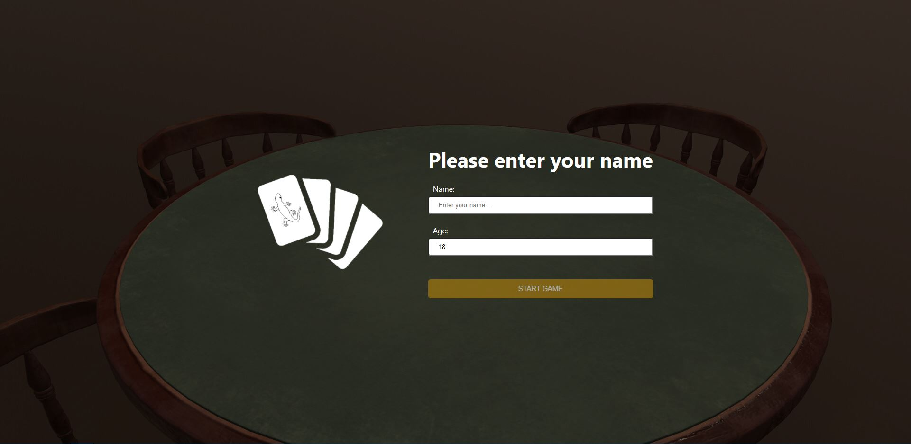
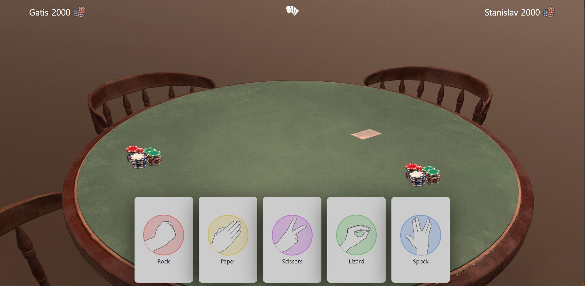
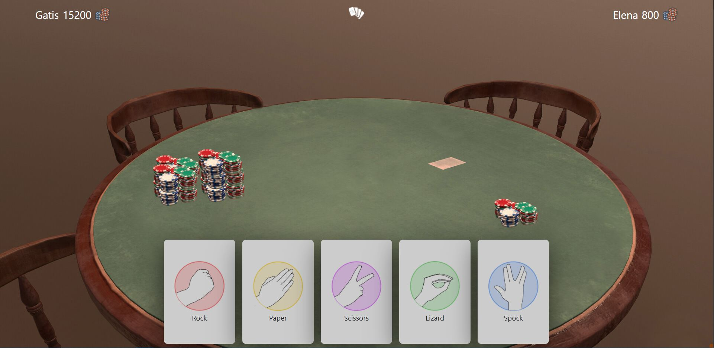

# Rock - Paper - Scissors - Lizard - Spock
## A Simple game using React

The game starts with the user entering his name and age. Аs you know, you can\`t gamble if you`re not in legal age.

After entering your name and confirming your age, you are seated at the table and the game starts.

You have been dealt 5 cards - Rock, Paper, Scissors, Lizard, Spock and 2000 chips.

Your objective is to try and beat 4 opponents by taking their chips.

- You can\`t start the game if you\`re underage or no name has been entered.
- The chip stack displayed on your table gets bigger or smaller depending on the chip count you and your opponent has.
- Opponent draws his card in random times.
- If you win one opponent you get seated with the next one until all opponents are beaten, or you lose.
- The game has a tiny secret that can allow you to win all hands, but again - it`s a secret.

